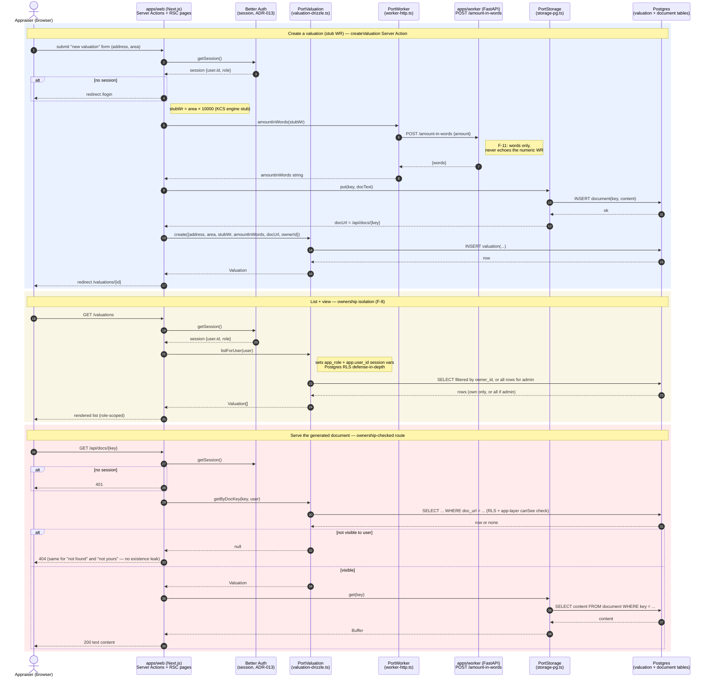

# wyceny

Internal tool for a Polish valuation practice ("kancelaria rzeczoznawcy majątkowego") that turns a ~3-hour manual property appraisal report ("operat szacunkowy") into a ~10–15 minute AI-assisted workflow: **AI proposes → appraiser confirms → appraiser signs**. The appraiser stays fully accountable for every figure — no field is ever silently defaulted.

This repo is the **application code**. Architecture decisions, product/domain context, and delivery history live in the companion wiki repo: [`make-it-simple-rayshar/wyceny`](https://github.com/make-it-simple-rayshar/wyceny).

## Status: walking skeleton (Slice 0) — deployed and live

This repo currently implements a **walking skeleton**: the thinnest possible end-to-end slice that crosses *every* architectural boundary the real product will need — authentication, database, file storage, the web↔worker service boundary, CI fitness functions, and production deployment — with the actual valuation logic, document generation, and AI integration replaced by stubs. The goal of a walking skeleton is to prove the whole envelope works before building features inside it; see [`docs/architecture/`](docs/architecture/) for why this pattern was chosen.

**Deployed and live:**
- Web: <https://wyceny-mu.vercel.app>
- Worker: <https://worker-production-c672.up.railway.app>
- Demo users: `aneta@wyceny.test` / `Admin123!` (admin), `zenon@wyceny.test` / `Rzeczoznawca123!` (appraiser)

## Tech stack

| Layer | Choice |
|---|---|
| Web framework | Next.js 16 (App Router, React Server Components, Server Actions) |
| Auth | Better Auth (self-hosted, Drizzle adapter, sessions in our own Postgres) — [ADR-013](docs/architecture/adr/ADR-013-auth-better-auth.md) |
| Database | Postgres, via Drizzle ORM, with Row-Level Security as defense-in-depth |
| UI | shadcn/ui + Tailwind CSS |
| Worker service | Python / FastAPI (`num2words` for Polish amount-in-words formatting) |
| Monorepo tooling | pnpm workspaces + Turborepo |
| CI | GitHub Actions |
| Hosting | Vercel (web) + Railway (worker + Postgres) |

## What works now (de facto, verified live)

The full flow below runs end-to-end in production:

1. **Log in** (Better Auth, email/password, closed sign-up — 5 trusted internal users).
2. **Create a valuation** (address + area) via a Server Action.
3. The Server Action calls the **worker over HTTP** (`PortWorker` → `apps/worker` `/amount-in-words`) to convert the (stub) valuation result into Polish words — e.g. *"pięćset czterdzieści tysięcy złotych zero groszy"*.
4. The generated (stub) document text is **stored in Postgres** (`PortStorage`) and served back through an **ownership-checked** route, `/api/docs/[key]`.
5. The valuation is **persisted** (`PortValuation` → Drizzle/Postgres).
6. **List + view** valuations with **role-based isolation**: an appraiser sees only their own; an admin sees all. Enforced at the app layer *and* by Postgres RLS (defense-in-depth, both independently tested).

See [`docs/architecture/README.md`](docs/architecture/README.md#current-e2e-flow-deployed-working) for the full Mermaid sequence diagram of this flow, or the copy below.



## What's stubbed (not yet real)

- **Valuation engine (KCS)**: `stubWr = round(area) * 10_000` in `apps/web/src/app/actions/create-valuation.ts`. The real KCS (Kwota Cen Średnich) comparative-approach engine — deterministic, golden-tested against a known result — doesn't exist yet.
- **Document**: the "operat" is a 5-line plain-text stub, not a real appraisal report (no sections, no formatting, no confidentiality masking).
- **AI / data-fetch**: no AI integration, no geocoding/land-registry/zoning data-fetch adapters exist yet. The only worker capability today is Polish amount-in-words formatting.
- **Multi-step gating**: the product's real 7-step "AI proposes → appraiser confirms" workflow (with per-step approval gates) doesn't exist yet — a valuation today has a single-step lifecycle (`in_progress` → `signed`).

## Fitness functions active in CI

Five architectural invariants are enforced automatically on every push/PR (`.github/workflows/ci.yml`). Full table (all 12, active + deferred) in [`docs/architecture/README.md`](docs/architecture/README.md#fitness-functions-f-1f-12).

| # | What | Where |
|---|---|---|
| F-1 | Golden WR harness (pins the create→worker→save pipeline shape) | `apps/web/tests/golden-wr.test.ts` |
| F-8 | Owner isolation (appraiser sees own, admin sees all) — app-layer + Postgres RLS | `apps/web/tests/rls-isolation.test.ts`, `docs-route.test.ts` |
| F-9 | No PII/secrets committed (PESEL, land-register numbers, signed PDFs) | `scripts/check-no-pii.sh` |
| F-10 | Hexagonal dependency rule (`domain/`/`packages/shared` never import adapters) | `.dependency-cruiser.cjs` |
| F-11 | Worker never returns a valuation-result field — words/data only | `apps/web/tests/worker-contract.test.ts`, `apps/worker/tests/test_amount_in_words.py` |

## Monorepo layout

```
apps/
  web/            Next.js app — pages, Server Actions, Route Handlers,
                   domain/ports/adapters, Drizzle schema + migrations
  worker/         Python/FastAPI service (num2words amount-in-words today)
packages/
  shared/         @wyceny/shared — Sourced<T> provenance kernel (ADR-010)
docs/
  architecture/   Developer-facing architecture docs (this repo)
.superpowers/sdd/ SDD task ledger — what shipped, task by task, plus backlog
```

See [`docs/architecture/README.md`](docs/architecture/README.md) for the hexagonal boundaries inside `apps/web/src/`.

## Local dev

Prerequisites: Node 22, pnpm ≥10, [uv](https://docs.astral.sh/uv/) (Python), Docker (for local Postgres).

```bash
# 1. Start local Postgres
cd apps/web && docker compose up -d

# 2. Install JS/TS deps (from repo root)
cd ../.. && pnpm install

# 3. Configure env vars
cp apps/web/.env.example apps/web/.env
# generate BETTER_AUTH_SECRET:
node -e "console.log(require('crypto').randomBytes(32).toString('hex'))"
# paste it into apps/web/.env

# 4. Apply migrations
cd apps/web && pnpm exec drizzle-kit migrate

# 5. Seed demo users (admin + appraiser)
pnpm run seed

# 6. Run the worker (separate terminal)
cd apps/worker && uv run uvicorn app.main:app --reload

# 7. Run the web app (separate terminal, from repo root)
pnpm dev
```

Web runs at <http://localhost:3000>, worker at <http://localhost:8000>. Log in with the seeded demo users (see `apps/web/scripts/seed.ts` for credentials).

**Tests / lint / typecheck / build** (from repo root): `pnpm turbo lint typecheck test build`. Worker tests: `cd apps/worker && uv run pytest`. Dependency rule (F-10): `pnpm depcruise`. No-PII scan (F-9): `bash scripts/check-no-pii.sh`.

## Known limitations / backlog

Carried forward from the walking-skeleton build (full history in `.superpowers/sdd/`):

- **Vercel is git-connected; Railway is not** — merging to `main` auto-deploys the web app to production (Vercel's GitHub integration; Root Directory `apps/web`, build command `next build`). The worker on Railway is still deployed manually (`railway up`) — it isn't wired to git yet, so a worker change needs an explicit deploy step after merge.
- **RLS covers reads only**: the Postgres RLS policy on `valuation` (`drizzle/0003_wycena_rls.sql` / `0005_english_domain_rename.sql`) is `FOR SELECT` only — `app_role` only has `GRANT SELECT`, and `create()` runs as the superuser pool connection (no role switch). Ownership on writes is enforced at the app layer today, not by an INSERT/UPDATE RLS policy; adding one is deferred.
- Full backlog with more detail: `.superpowers/sdd/progress.md` in the [wiki repo](https://github.com/make-it-simple-rayshar/wyceny) (this app repo's own `.superpowers/sdd/` holds per-task briefs/reports and the English-ification report).

## More docs

- [`docs/architecture/`](docs/architecture/) — pattern, hexagonal boundaries, fitness functions, ADR summaries.
- Wiki repo (canonical decisions + full product/domain context): [`make-it-simple-rayshar/wyceny`](https://github.com/make-it-simple-rayshar/wyceny).
