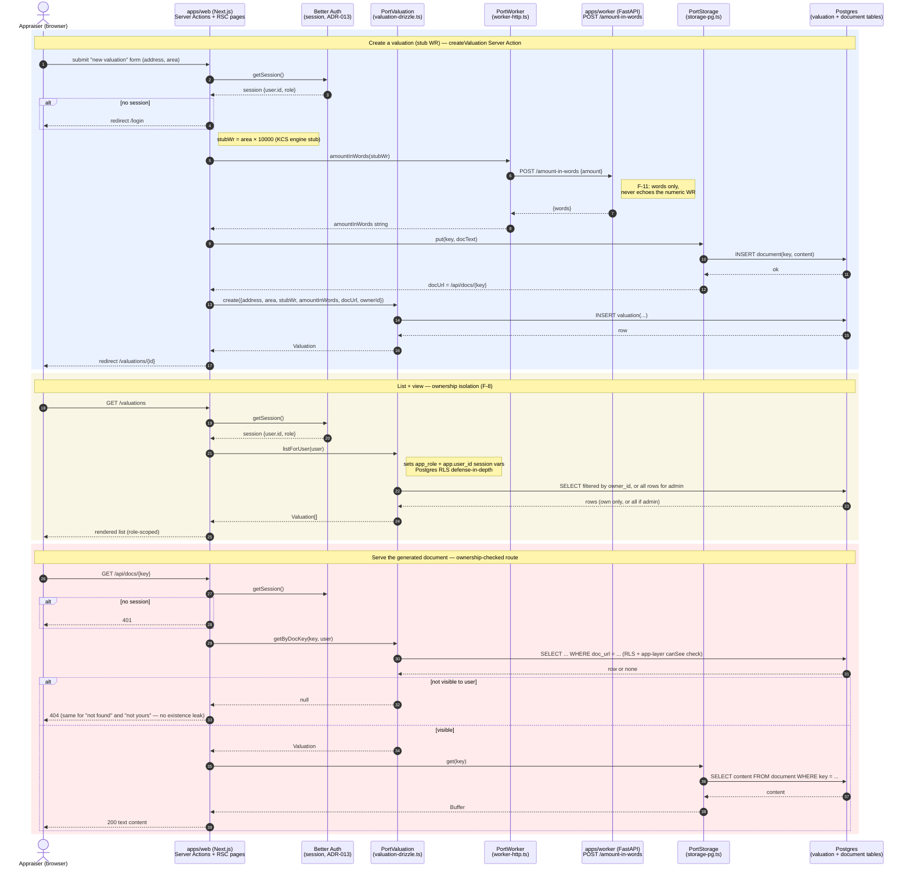

# Architecture

> **Canonical source:** the [`wyceny` wiki repo](https://github.com/make-it-simple-rayshar/wyceny) (`wiki/decisions/ADR-008..013`, master plan at `.claude/arch-plans/mvp-wyceny/architecture-plan.md`) is where architecture decisions are actually made and discussed, in Polish, with full context (drivers, alternatives considered, trade-offs). Everything in `docs/architecture/` is a **developer-facing English copy** that lives next to the code for people working in this repo day-to-day. If the two ever disagree, the wiki wins — file an issue/PR to resync.

## Pattern: modular monolith with asymmetric Hexagonal

The app is one deployable process (`apps/web`) plus one adapter service (`apps/worker`), organized internally as a **modular monolith**. Within it, four "Core" bounded contexts (the parts with real legal/competitive weight — the valuation lifecycle, the comparable-sample, the feature/weight model, and the KCS calculation engine) get full **Hexagonal / Ports & Adapters** isolation. Supporting contexts get lighter modular separation, and Generic concerns (geo data, rendering, auth, storage) sit behind thin Anti-Corruption Layers. See [ADR-008](adr/ADR-008-modular-monolith-hexagonal.md) for the full rationale — this asymmetry is deliberate: full rigor where determinism/extensibility/compliance matter most, less ceremony everywhere else.

### Hexagonal boundaries in this repo

```
apps/web/src/
├── domain/       pure business logic — zero I/O, zero framework imports
├── ports/        pure TS interfaces (contracts) — zero I/O
├── adapters/     concrete implementations of ports (Drizzle, HTTP, Postgres)
├── db/           Drizzle schema + client — infrastructure detail
└── app/          Next.js App Router: pages, Server Actions, Route Handlers,
                  and the ONE composition root (_deps.ts) that wires adapters
```

**The rule (mechanically enforced, F-10):** `domain/` and `packages/shared` never import from `adapters/`, `db/`, or `drizzle-orm`/`pg`/`next`/`better-auth` directly. They may only depend on `ports/` (type-level contracts). Concrete adapters are instantiated exactly once, in `apps/web/src/app/valuations/_deps.ts`, and handed down into Server Actions / Route Handlers from there. This means the domain layer (today: `domain/valuation.ts`) can be unit-tested with zero network, zero database, zero mocking of infrastructure.

Today there is one Core context wired end-to-end this way (Valuation, with a stub calculation) — the other three Core contexts (Comparable Sample, Features & Weights, KCS Engine) don't exist yet; they'll follow the same shape when built.

### The web↔worker boundary (ADR-009): Open Host Service

`apps/web` (Next.js, TypeScript) and `apps/worker` (Python/FastAPI) communicate over a narrow, versioned **HTTP/JSON contract** — an Open Host Service. Web calls the worker through an output port (`PortWorker`), never directly. The load-bearing invariant: **the worker does I/O and presentation only and never returns a valuation-result (WR) field** — all valuation arithmetic lives in the TypeScript core. This keeps the calculation deterministic and testable without the worker in the loop, and keeps the worker a swappable, reusable set of adapters (geo, num2words, document rendering, OCR) rather than a second copy of business logic. See [ADR-009](adr/ADR-009-web-worker-open-host-service.md).

Today the contract has exactly one endpoint: `POST /amount-in-words` (Polish "kwota słownie" formatting). The geo/EGiB/MPZP/RCN and document-rendering endpoints described in the plan don't exist yet.

### `Sourced<T>` shared kernel (ADR-010)

`packages/shared` exports `Sourced<T> = { value: T, provenance: { source, status } }`, a deliberately tiny Shared Kernel that exists to make "no silent defaults" provable at the type level: a required field with no confirmed data must carry `to_verify`/`none` provenance, never a value that looks confirmed but isn't. `status` can only be set to `confirmed` on the web-side ACL boundary — a data source or the worker cannot claim `confirmed` for itself. See [ADR-010](adr/ADR-010-sourced-provenance-shared-kernel.md).

The type is implemented and unit-tested (`packages/shared/src/sourced.ts`) but **not yet consumed** by the walking skeleton — `Valuation` fields today are plain values, because there's no real sourced data (geocoder, land registry, RCN) flowing through the system yet.

### Reproducibility & gating (ADR-011, ADR-012)

Two more Core-context decisions with target shapes not yet built in this repo:
- **ADR-011** — reproducibility via a write-once `SnapshotProby` (freezes the full calculation contract at compute time) plus `supersedes`-linked immutable versions after signing, instead of full event sourcing. Today only the narrower write-once guard exists (`assertNotSigned()` in `domain/valuation.ts`) — there's no snapshot mechanism or versioning yet because there's no real calculation to snapshot.
- **ADR-012** — the product's 7-step gated workflow ("AI proposes → appraiser confirms", step N+1 unlocked only once step N is approved) orchestrated as a synchronous process manager on the `Valuation` aggregate. Not implemented yet — the walking skeleton has a single-step lifecycle (`in_progress` → `signed`), not the multi-step gated flow.

### Auth & authorization (ADR-013)

Better Auth (self-hosted, Drizzle-backed) handles authentication. Authorization is **domain logic** (role + ownership), not database RLS — but Postgres RLS is layered on top as defense-in-depth, and file access goes through an app-layer ownership check before serving. Fully implemented — see [ADR-013](adr/ADR-013-auth-better-auth.md) for the two-layer enforcement detail and exactly which files implement it.

## Current E2E flow (deployed, working)

This is what is actually deployed and working today — not the target architecture, the current one. It shows the three flows that exist: create a valuation (through the worker OHS boundary), list with ownership isolation, and serve the generated document.



Boundaries labeled: the `PW`/`Worker` hop is the OHS boundary from ADR-009 (F-11 enforced — worker returns words, never the WR number); `PV`'s Postgres interaction is the F-8 ownership boundary from ADR-013 (app-layer check + RLS defense-in-depth); `Auth` gates every entry point. Deployed at web https://wyceny-mu.vercel.app and worker https://worker-production-c672.up.railway.app — this diagram matches production, not an aspiration.

## Fitness functions (F-1..F-12)

Fitness functions are automated checks that hold an architectural decision true as the codebase grows. Defined in the master plan (`architecture-plan.md` §10); the five below are wired into this repo's CI today.

| # | Name | What it checks | Status | Where |
|---|------|-----------------|--------|-------|
| F-1 | Golden WR test | Known input → known valuation result (WR), no network | **ACTIVE** | `apps/web/tests/golden-wr.test.ts` — currently a *shape* harness (pins the create→worker→save pipeline contract); becomes the real "WR = 1,044,400 from the Kościelna dataset" assertion once the KCS engine lands |
| F-2 | Engine determinism | Zero I/O inside the calculation core | Deferred | No KCS engine exists yet to check |
| F-3 | Reproducibility | Mutate a live data source, re-run → identical WR (adversarial) | Deferred | Needs the write-once snapshot (ADR-011) |
| F-4 | Provenance/gating gate | `to_verify`/`none` blocks step approval (aggregate invariant) | Deferred | Needs the multi-step gating flow (ADR-012) + `Sourced<T>` wired into the domain |
| F-5 | Sample-size invariant | Fewer than 12 comparable transactions blocks the sample | Deferred | Needs the Comparable Sample context |
| F-6 | Weights sum ≈ 1 | Expert-preset weights sum correctly; no regression coefficients in the engine | Deferred | Needs the Features & Weights context |
| F-7 | Immutability after signing | Editing a signed record is rejected (adversarial) | Partial | `assertNotSigned()` (`domain/valuation.ts`) is unit-tested (`valuation-repo.test.ts`), but there is no edit/mutation code path yet for an adversarial end-to-end test to attack |
| F-8 | Owner isolation / RLS | Appraiser sees only their own valuations; admin sees all | **ACTIVE** | `apps/web/tests/rls-isolation.test.ts` (raw-SQL test proving DB-level RLS independently blocks cross-owner reads), `apps/web/tests/docs-route.test.ts`, app-layer checks in `adapters/valuation-drizzle.ts` and `app/api/docs/[key]/route.ts` |
| F-9 | No sensitive data in VCS | No unredacted PESEL / land-register (KW) numbers / signed-deed PDFs committed | **ACTIVE** | `scripts/check-no-pii.sh`, dedicated CI step |
| F-10 | Dependency rule (Hexagonal) | `domain/` and `packages/shared` never import adapters/db/framework packages | **ACTIVE** | `.dependency-cruiser.cjs`, dedicated CI step (`pnpm depcruise`) |
| F-11 | web↔worker contract | The worker never returns a WR field — words/data/files only | **ACTIVE** | `apps/web/tests/worker-contract.test.ts`, `apps/worker/tests/test_amount_in_words.py`, dedicated CI step for worker tests |
| F-12 | Document completeness | Generated report has ≥19 required sections + confidentiality masking applied | Deferred | Document generation is currently a stub text string, not a real report |

CI wiring for the five active checks (see `.github/workflows/ci.yml`):
1. `pnpm turbo lint typecheck test build --env-mode=loose` — runs F-1, F-7 (partial), F-8, F-11's TypeScript-side tests as part of the normal Vitest suite, plus the Next.js build.
2. `bash scripts/check-no-pii.sh` — F-9, a dedicated step.
3. `pnpm depcruise` — F-10, a dedicated step.
4. `uv run pytest -q` in `apps/worker` — F-11's Python-side test.

## See also

- Root [`README.md`](../../README.md) — walking-skeleton status, stack, what currently works, local dev setup.
- Wiki repo (canonical decisions, full Polish context): [`make-it-simple-rayshar/wyceny`](https://github.com/make-it-simple-rayshar/wyceny), especially `wiki/decisions/ADR-008..013*.md` and `.claude/arch-plans/mvp-wyceny/architecture-plan.md`.
- SDD ledger (what shipped, task by task, plus the full backlog): `.superpowers/sdd/` in this repo.
